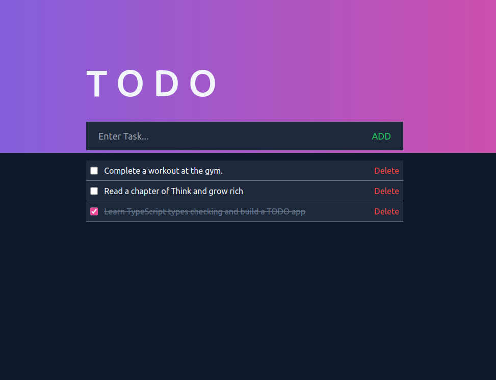

<a name="readme-top"></a>

<div align="center">
  <h1>TODO 🎯</h1>
</div>

<!-- TABLE OF CONTENTS -->

# 📗 Table of Contents

- [📖 About the Project](#about-project)
  - [🛠 Built With](#built-with)
    - [Tech Stack](#tech-stack)
    - [Key Features](#key-features)
  - [🚀 Live Demo](#live-demo)
- [💻 Getting Started](#getting-started)
  - [Setup](#setup)
  - [Prerequisites](#prerequisites)
  - [Install](#install)
  - [Usage](#usage)
  - [Deployment](#deployment)
- [👥 Authors](#authors)
- [🔭 Future Features](#future-features)
- [🤝 Contributing](#contributing)
- [⭐️ Show your support](#support)
- [🙏 Acknowledgements](#acknowledgements)
- [📝 License](#license)

<!-- PROJECT DESCRIPTION -->

# 📖 TODO TypeScript <a name="about-project"></a>

**TODO TypeScript** is a simple web application that I built for the purpose of learning and practicing TypeScript. The app allows users to add, edit, remove, and check completed daily tasks. It is designed to help users keep track of their daily to-do lists and stay organized. With TypeScript, the app offers type checking and static analysis, ensuring that the code is more reliable and maintainable.👍

## 🖼️ Preview



## 🛠 Built With <a name="built-with"></a>

### Tech Stack <a name="tech-stack"></a>

<ul>
  <li><a href="https://www.w3schools.com/html/">HTML</a></li>
  <li><a href="https://tailwindcss.com/">TailwindCSS</a></li>
  <li><a href="https://www.typescriptlang.org/">TypeScript</a></li>
  <li><a href="https://www.snowpack.dev/">Snowpack</a></li>
</ul>

<!-- Features -->

### Key Features <a name="key-features"></a>

- **Add a task**
- **Edit a task title**
- **Check completed task**
- **Remove completed task**

<p align="right">(<a href="#readme-top">back to top</a>)</p>

## 🚀 Live Demo <a name="live-demo"></a>

- [Click and checkout the live demo 🚀.](https://todo-typescript-practice.netlify.app/)

<p align="right">(<a href="#readme-top">back to top</a>)</p>

<!-- GETTING STARTED -->

## 💻 Getting Started <a name="getting-started"></a>

To get a local copy up and running, follow these steps.

### Prerequisites

First you need the following tools:

- Browser such as (Chrome, FireFox, ...etc)
- A Code Editor such as (VsCode, Sublime or Atom)
- A package manager such as (npm or yarn)
- Node.js should be installed on your local machine, [download nodejs](https://nodejs.org/en) if not.

### Setup

Clone this repository to your desired folder:

```sh
  cd my-folder
  git clone git@github.com:adel-gu/Todo-typescript.git
```

### Install

- Install this project using yarn:

```sh
  cd Todo-typescript
  yarn install
```

- And if you are using npm, ensure to delete the file **[yarn.lock]** and run:

```sh
  cd Todo-typescript
  npm install
```

### Usage

To run the project, execute the following command:

```sh
  yarn start
```

If you are using npm:

```sh
  npm start
```

### Deployment

You can deploy this project using netlify cli, or from the official website of [Netlify](https://app.netlify.com/).

<p align="right">(<a href="#readme-top">back to top</a>)</p>

<!-- AUTHORS -->

## 👥 Author <a name="authors"></a>

👤 **Adel GUITOUN**

- GitHub: [@adel-gu](https://github.com/adel-gu)
- Twitter: [@GuitounAdel](https://twitter.com/GuitounAdel)
- LinkedIn: [adelguitoun](https://linkedin.com/in/adelguitoun)

<p align="right">(<a href="#readme-top">back to top</a>)</p>

<!-- FUTURE FEATURES -->

## 🔭 Future Features <a name="future-features"></a>

- [ ] **Add the functionality of drag and drop completed task to the completed section**

<p align="right">(<a href="#readme-top">back to top</a>)</p>

<!-- CONTRIBUTING -->

## 🤝 Contributing <a name="contributing"></a>

Contributions, issues, and feature requests are welcome!

Feel free to check the [issues page](../../issues/).

<p align="right">(<a href="#readme-top">back to top</a>)</p>

<!-- SUPPORT -->

## ⭐️ Show your support <a name="support"></a>

If you like this project and you find it a helpfull to get an idea of how typescript works, feel free to clone it and please leave a start ⭐️

<p align="right">(<a href="#readme-top">back to top</a>)</p>

<!-- ACKNOWLEDGEMENTS -->

## 🙏 Acknowledgments <a name="acknowledgements"></a>

I would like to thank Microsoft Corporation for Typescript 👍 and the way its documentation is structured.

<p align="right">(<a href="#readme-top">back to top</a>)</p>

<!-- LICENSE -->

## 📝 License <a name="license"></a>

This project is [MIT](./MIT.md) licensed.

<p align="right">(<a href="#readme-top">back to top</a>)</p>
